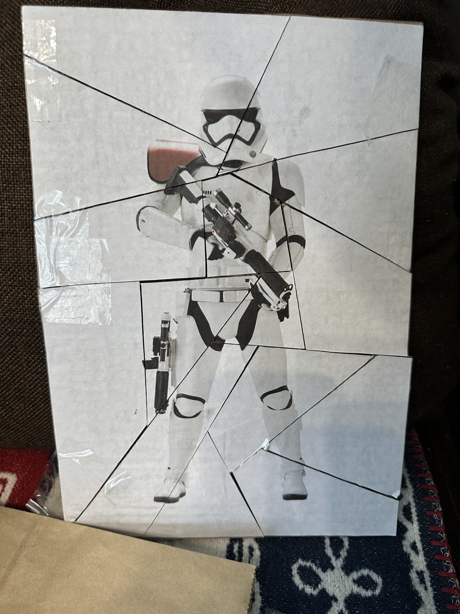

Guess the trooper game.

<h1 align="center">Guess the Trooper</h1>
 

</img>

In this game you need to guess a trooper by his shadow.

</img>

[Play it online](https://main--comfy-hummingbird-713cfe.netlify.app/) 🕹️

## Quick start

1. Clone the repo.
2. Change directory to the repo.
3. Run `yarn start` to start the Metro Bundler.
4. Press `i` to start the iOS simulator or `a` to run the Android emulator.📱

Happy hacking! 🤓

## Available commands

- `yarn start` - start Metro Bundler.
- `yarn ios` - run on iOS.
- `yarn android` - run on Android.
- `yarn web` - run on web.
- `yarn lint` - check code for errors.
- `yarn release` - generate a changelog, bump the version of app and create a new tag.
- `yarn test` - run tests.
